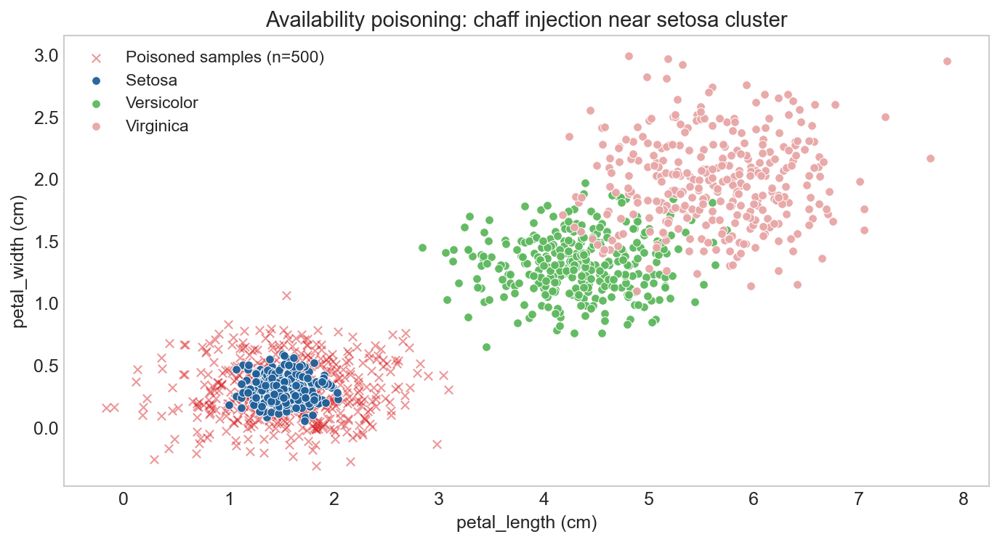
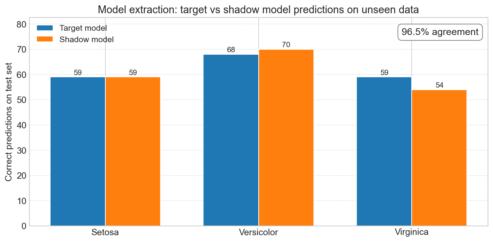

# Adversarial ML Attacks: Data Poisoning, Targeted Misclassification, and Model Extraction

[](https://www.python.org/)
[](https://scikit-learn.org/)
[](LICENSE.txt)
[](https://www.heinz.cmu.edu/)
[](https://www.heinz.cmu.edu/)

`adversarial-ml` · `data-poisoning` · `model-extraction` · `mlsec` · `nist-ai-100-2` · `mitre-atlas` · `logistic-regression` · `scikit-learn`

## About

Testing three adversarial ML attack vectors against a supervised logistic regression classifier to measure accuracy degradation, decision boundary shifts, and shadow model replication fidelity. Each attack maps to a different threat model and requires a different defensive response.

The dataset is intentionally low-dimensional (Iris-style flower measurements, 4 features) so the decision boundary is directly visualizable under attack. Implementation follows the threat taxonomy in NIST AI 100-2e2025 and MITRE ATLAS.

[Portfolio write-up](https://adarsh-rai.com/projects/adversarial-ml-attacks) · [Notebook](ml_attacks_data_poisoning_model_extraction.ipynb) · [LinkedIn series](https://linkedin.com/in/adarsh-rai-secure/)

## Results


| Attack | Access Required | Outcome | Detection |
|---|---|---|---|
| Availability poisoning | Append to training pipeline | 93% → 64.5% accuracy, setosa recall 100% → 3.4% | Low difficulty |
| Targeted misclassification | Append + target knowledge | Single prediction flipped, global accuracy preserved | High difficulty |
| Model extraction | Query-only (black box) | 96.5% shadow model agreement on unseen data | Medium difficulty |

## Attacks

### Availability Poisoning



500 mislabeled chaff samples were injected near the setosa centroid (`μ_setosa + 0.3·σ·N(0,1)`) and labeled as versicolor. The attacker holds append-only access to the training pipeline — no existing samples were modified.


Damage is **directional**, not uniform: 57 of 59 setosa samples reclassify as versicolor while the other two classes are unchanged. From an aggregate accuracy dashboard this looks like generalized model decay, with no trace back to a specific record. Per-class recall monitoring is what makes it visible.

### Targeted Misclassification

100 tightly clustered samples (`spread = 0.03·σ`) around a single target test point, mislabeled as virginica, shift the local decision boundary around that point. The target setosa sample reclassifies as virginica. Test-set accuracy remains within normal variance, so dashboards that only track aggregate metrics see nothing.

This is the harder attack to catch: there is no global signature, the perturbation is localized in feature space, and the attacker need only succeed once for the targeted input.

### Model Extraction



2,000 synthetic queries drawn from the marginal distribution of the training features. A Random Forest surrogate is trained on the (input, prediction) pairs returned by the target model. On unseen test data, the surrogate matches the target on **96.5% of predictions** despite a completely different model architecture (RF vs. linear).

The economic implication scales: protecting model weights means nothing if the prediction API itself is unrestricted. A surrogate trained for the cost of N queries replicates the function the original was built to monetize.

## Dataset

Extended Iris dataset: 1,200 samples, 21 engineered features, 3 species (setosa, versicolor, virginica). Core classification uses 4 features: sepal length, sepal width, petal length, petal width. Split is 1,000 train / 200 test with `np.random.seed(1)`.

## Tech Stack

| Layer | Technology |
|---|---|
| Language | Python 3.13 |
| ML | scikit-learn 1.7 (LogisticRegression, RandomForestClassifier) |
| Data | pandas, numpy |
| Visualization | matplotlib, seaborn |
| Environment | Jupyter Notebook |

## Defensive Controls

Each attack has a different defensive profile. Summary (full mappings to NIST AI 100-2e2025 and ENISA *Securing ML Algorithms* in the portfolio write-up):

| Threat | Controls |
|---|---|
| Availability poisoning | Per-class performance monitoring, input distribution validation, training data provenance and lineage tracking |
| Targeted misclassification | Differential model testing, localized boundary monitoring, prediction provenance for high-stakes inputs |
| Model extraction | Query rate limiting, query distribution analysis, output perturbation, model watermarking |

## Reproduce

```bash
pip install scikit-learn==1.7 numpy pandas matplotlib seaborn jupyter
jupyter notebook ml_attacks_data_poisoning_model_extraction.ipynb
```

Run cells in order. The notebook is self-contained — all attacks reproduce deterministically with the seeds in the source (`np.random.seed(1)` for poisoning, `np.random.seed(2)` for targeted, `np.random.seed(3)` for extraction queries).

## References

- NIST AI 100-2e2025: *Adversarial Machine Learning* — [csrc.nist.gov](https://csrc.nist.gov/pubs/ai/100/2/e2025/final)
- MITRE ATLAS: *Adversarial Threat Landscape for AI Systems* — [atlas.mitre.org](https://atlas.mitre.org)
- ENISA: *Securing Machine Learning Algorithms* — [enisa.europa.eu](https://www.enisa.europa.eu/publications/securing-machine-learning-algorithms)
- AVID: *AI Vulnerability Database* — [avidml.org](https://avidml.org)
- Tramèr et al. (2016). *Stealing Machine Learning Models via Prediction APIs*. USENIX Security.
- Scanlon, T. P. & Schumock, S. *AI and Machine Learning for Cybersecurity (95-767)*, Carnegie Mellon University, Heinz College.

## Author

**Adarsh Rai**
MS Information Security Policy & Management, Carnegie Mellon University · Heinz College (2026)
Graduate Teaching Assistant, *AI and Machine Learning for Cybersecurity* (95-767)

[Portfolio](https://adarsh-rai.com) · [LinkedIn](https://linkedin.com/in/adarsh-rai-secure/) · [GitHub](https://github.com/adarsh-rai-secure)

## License

[MIT](LICENSE.txt) — Copyright (c) 2026 Adarsh Rai

---

Built by [Adarsh Rai](https://adarsh-rai.com) · Carnegie Mellon University · Heinz College · 2026
